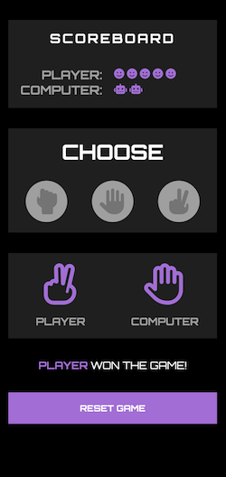
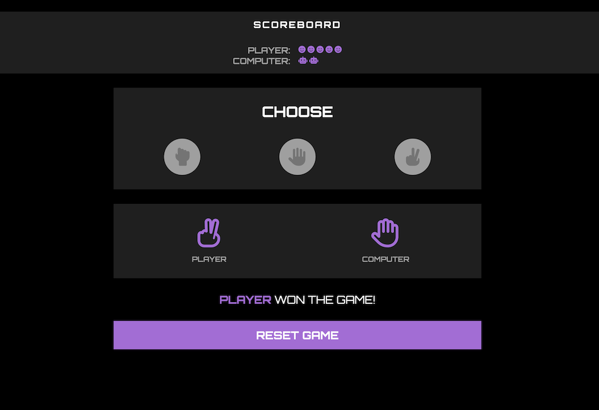

# Rock, Paper, Scissors Game

## Overview

This simple web-based game allows users to play the classic Rock, Paper, Scissors against the computer.

## How to Play

1. Open the game in your web browser.
2. Make a selection by choosing either Rock, Paper, or Scissors.
3. See the computer's choice.
4. Find out the winner of the round.
5. Keep playing until one player reaches the target score of 5 to win the game.

## Learning Highlights

**JavaScript Functions**
- Organized code with JavaScript functions for specific tasks.
- Implemented functions for game logic, including determining round winners and updating the scoreboard.

**Responsive Layout**
- Applied a mobile-first approach for a seamless user experience on various devices.
- Developed a responsive layout that adapts to different screen sizes.

**Git Branch and Merge**
- Utilized Git branches and merging to manage development efficiently.

## Screenshots

